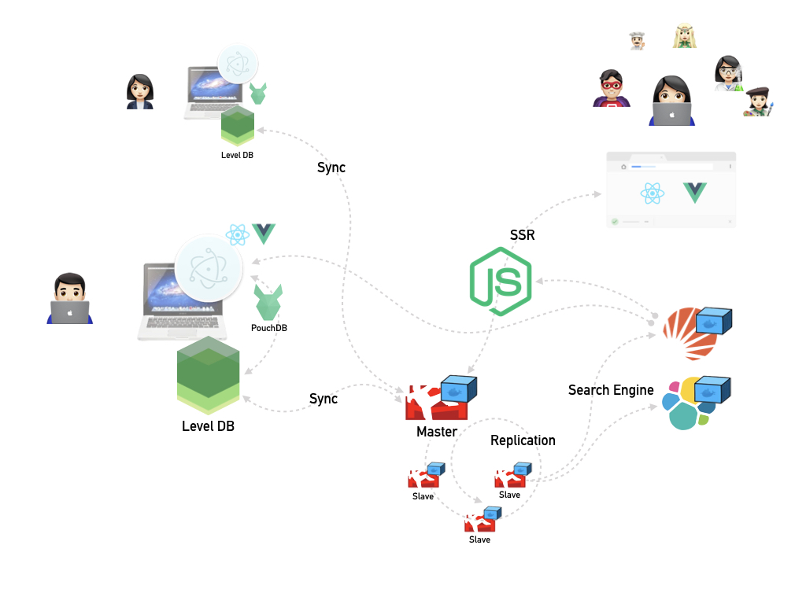

# Project

The purpose of this project is to demonstrate the concept of an environment for offline-first web application development with Electron and modern web stacks.

It consists of three main components.

* Electron + Vue.js SPA + LevelDB
* CouchDB cluster
* Universal Rendering Framework
* (Optional) Search Engine

## Structure Diagram

```bash
electron -> app -> PouchDB(leveldb)
                          \ (sync)
                           CouchDB:5984 ----- Solr or ES
                          / OAuth (2.0)
browser -> web(nuxt.js):9001
                       \
                        firbase (Notification and Etc)
                       /
        -> spa(vue, nginx):9000
```

### illustration



* app
  * based on https://github.com/SimulatedGREG/electron-vue
* web(ssr)
  * based on create-nuxt-app
  * pwa - https://github.com/nuxt-community/pwa-module
  * axios - https://github.com/nuxt-community/axios-module
  * auth - https://github.com/nuxt-community/auth-module
  * i18n - https://github.com/nuxt-community/nuxt-i18n
  * sentry - https://github.com/nuxt-community/sentry-module
  * stylus
* spa
  * based on @vue/cli

## Makefile

```bash
make init

# to build container every components (electron, spa, ssr)
make build

# to boot up every components on the docker environment using docker-compose
make up
# to re-boot up every components
make restart
# to clean and remove every components that working on docker environment
make clean
```

## TODO

* [ ] [CouchDB Configuration for Clustering](http://docs.couchdb.org/en/stable/config/cluster.html)
* [ ] SPA/SSR Web Application integrate with CouchDB
* [ ] Add Apache Solr or Elastic Search in stack.yml
  * [ ] Add search function to SPA/SSR app
* [ ] Filtered replication - https://pouchdb.com/api.html#filtered-replication
* [ ] Authentication - https://github.com/pouchdb-community/pouchdb-authentication

## Refrences

* https://github.com/pouchdb-community

## License

MIT